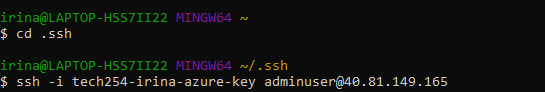
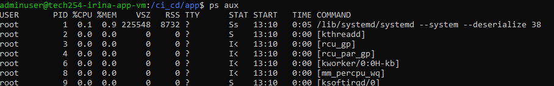
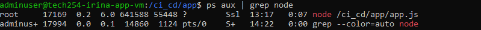
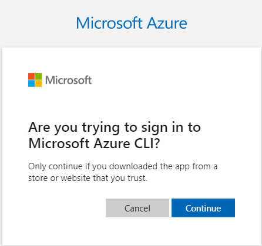

# Blob Storage

**Blob storage in Azure** is a service that allows you to *store large amounts of unstructured data* such as text, images, audio, video or any other kind of binary data. 


### Blob storage has three types of resources: 


1. **Storage accounts** = a unique namespace that contains your data. 
2. **Containers** = a logical grouping of blobs within a storage account (*equivalent of Buckets in AWS S3*).
3. **Blobs** = an individual object that can be accessed by a URL.

<br>

## Access Tiers (depending on how often you access the file):
1. **Hot Tier** (Access: *Frequent*)
* *cheaper to access* (but more expensive to store)
* really quick to load

2. **Cold Tier** (Access: *Medium*)
* *costs more to access* (but not as expensive to store)
* takes longer to load

3. **Archival Tier** (Access: *months/years in between accessing*)
* *cheapest tier* (costs the least to store, but costs more when you do access)
* takes a really long time to load (hours)

<br>


## Types of Redundancy ( = having backups):

### **LRS - Locally Redundant Storage**


- **cheapest**
- storing in only *one data center* (Availability Zone) 
- puts *3 copies in 1 data center*

### **ZRS - Zone Redundant Storage**


- **more expensive**
- *3 copies of blob*, one in *each data center* (Availability Zone) 

<br>

### Other Important Points:
* You can access this through either Azure Powershell (similar to WCP - Windows Command Prompt) or Azure CLI (which is a little bit more like Linux). Both can run commands.
* Every command starts with `az`.
* In our script, we will create storage account, create a container, get a blob, download it and upload it to container we made, then give public access to the blob. Then in our app files, we will change 'views - index' file to add that blob (which is a .jpg) to the home page of our app (this will be linked straight to the blob location).


<br>

## Steps:

1. Connect through SSH to your VM that is running the App (which was started through User Data using PM2).




2. Once you're in the VM, go to the root folder and then find your app and run `npm install`:

```shell
# going into root folder
cd /

# going into app folder
cd /ci_cd/app

npm install
```

3. If you try to run the app, it will tell you it's already running on port 3000, and we can't have 2 apps running at the same time:

```shell
node app.js
```


```shell
pm2 start app.js
```


4. You can check what processes are running (it will give you a massive list):

```shell
ps aux
```



5. You can narrow it down by using `grep`:

```shell
ps aux | grep node
```


6. The App was started through User Data, so that's why 'user' shows as `root`. You can now try to kill it using `sudo kill`, but it will still pop back up with a different Process ID:

```shell
sudo kill -9 17169
```


10. What you need to do is to to kill `pm2`, which will allow you to start the App from 'adminuser' without problems:


<br>

### How to install Azure CLI

1. The command to install Azure CLI:

```shell
curl -sL https://aka.ms/InstallAzureCLIDeb | sudo bash
```


2. To Login: 

```shell
az login
```


3. On the Link, you will have to enter the code from the console: 


2. You will have to confirm:



3. It will give you confirmation you have logged in. 


<br>

### Adding a Blob to our App Home Page:

 #### You will need to have the right permissions to containers and blobs.

1. First we will create the Storage Account:

```shell
az storage account create --name tech254irinastorage --resource-group tech254 --location uksouth --sku Standard_ZRS 
```


2. Then we will create the container:

```shell
az storage container create \
 --account-name tech254irinastorage \
 --name testcontainer \
 --auth-mode login
```


3. Download a photo to the VM:

```shell
curl -O https://img.freepik.com/free-photo/cyber-cat-with-giant-electro-flowers-sunrise-generative-ai_8829-2880.jpg
```


4. You can rename the photo:

```shell
mv cyber-cat-with-giant-electro-flowers-sunrise-generative-ai_8829-2880.jpg cat.jpg
```

4. Upload the photo as a blob:

```shell
az storage blob upload \
 --account-name tech254irinastorage \
 --container-name testcontainer \
 --name newcat.jpg \
 --file cat.jpg \
 --auth-mode login
```


5. If you want to see it has been uploaded successfully, go to Storage and click on your container:


6. Go to the location of the `index.ejs` where we will modify it to display the `cat.jpg` photo on the Home Page:

```shell
cd /ci_cd/app/views
```

6. You can try modifying the `index.ejs` file with the `sed` command:

```shell
sed -i 's|</h2>|</h2>|' index.ejs
```

7. If it doesn't work, you can modify it manually:

```shell
sudo nano index.ejs
```

8. Add the image code to the file:

```shell

```


8. Restart the app for your modification to be displayed: 

```shell
pm2 restart app.js
```


<br>

Sources:
- [Blobs - microsoft.com](https://azure.microsoft.com/en-us/products/storage/blobs/)
- [Introduction to Blobs - microsoft.com](https://learn.microsoft.com/en-us/azure/storage/blobs/storage-blobs-introduction)
- [Install Azure CLI - microsoft.com](https://learn.microsoft.com/en-us/cli/azure/install-azure-cli)