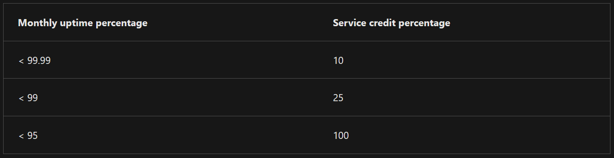
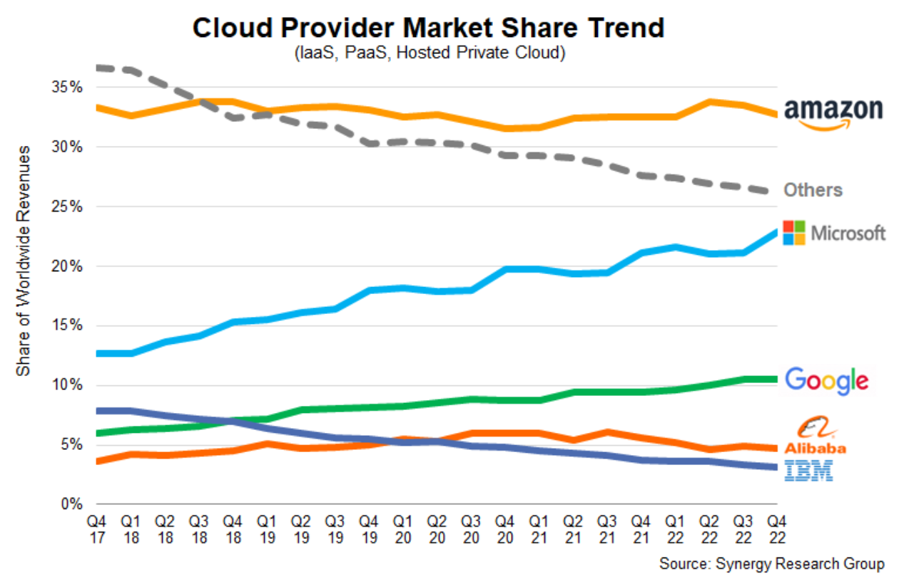
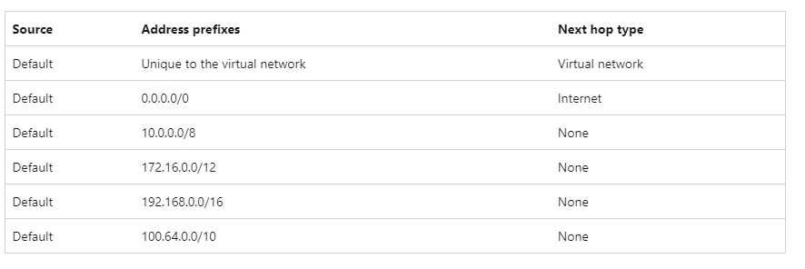
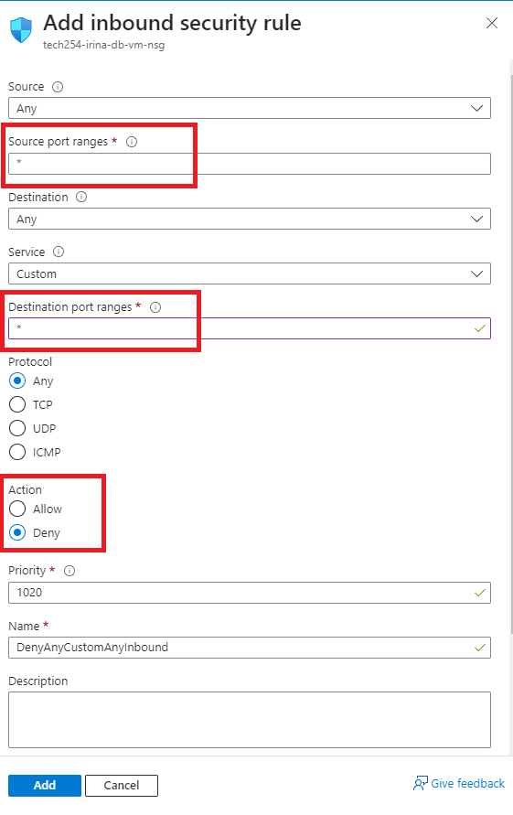
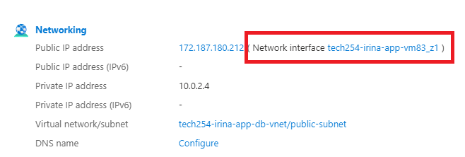
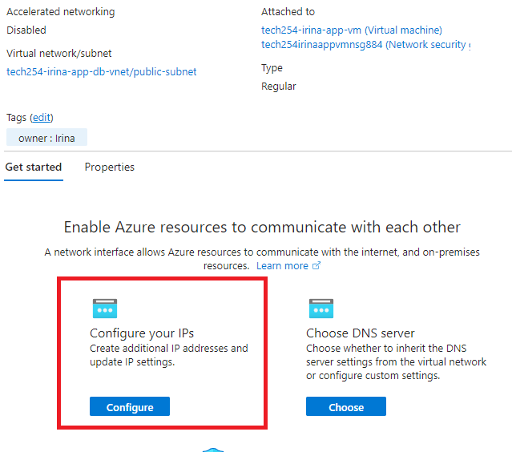
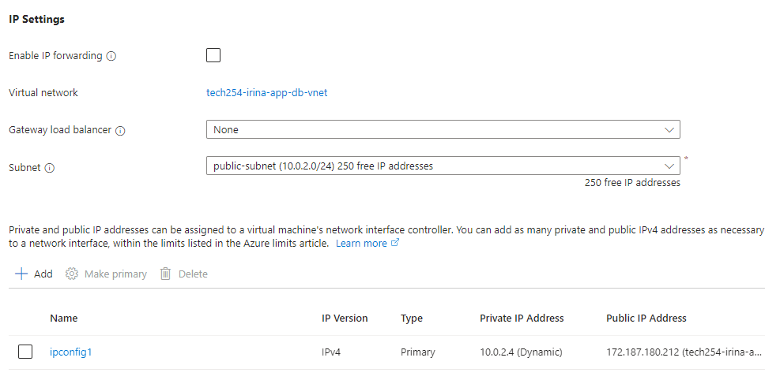
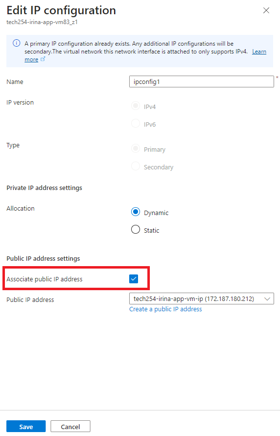

# Azure

### Azure is divided into *Scopes*:

1. Root Management Group
2. Management Groups (6 levels)
3. Subscriptions
4. Resource Groups
5. Resources

 

### Important points:
* Management Groups = a way to manage and access company polices for multiple subscriptions.
* Subscriptions = payment account/methods/scheme.
* All resources need to be inside *a Resource Group*. 
* With these layers (**Scopes**), we apply policies/permissions/compliance. You can set *different policies or permissions for each Scope.* 
* We will add *'owner'* tag (with our Name) to each resource we create.
* *Azure Firewall* - a very expensive service (cheapest version **£250/month**)
* The interface in Azure is called **The Azure Portal** 
* **Active Directory** => Microsoft's proprietary directory service; it essentially controlls users' ecosystem and enables administrators to manage permissions and control access to network resources. 
* **SLA (Service Level Agreement)**: guarantees the more they fall short, the more money you can ask back:

 

### Marketshare:

In the fourth quarter of 2022, the most popular vendor in the cloud infrastructure services market, Amazon Web Services (AWS), controlled 32 percent of the entire market. Microsoft Azure takes second place with 23 percent market share, followed by Google Cloud with 10 percent market share. Together, these three cloud vendors account for 65 percent of total spend in the fourth quarter of 2022.

 

 

### Comparisons to AWS:
* What we call *VPCs* in AWS, in Azure they are called **Virtual Networks** (*V Nets*).
* There are also Resource Groups in AWS, but we didn't need to use them.
* With AWS, Availability Zones in a Region are not limited to 3. In Azure, AZs per region - maximum of 3 (some have 1 or 2). 
* In Azure, zone = data center.

 

### System Routes
System routes are the routes that Azure automatically creates and assigns to each subnet in a virtual network. You can't create or remove system routes, but you can override some of them with custom routes.

By default, Azure creates the following system routes for each subnet:

 

### How to make rules stricter on Database security group:

Update rules to lock down network security group in the database VM:  
* Allow SSH source only from our app virtual machine or public subnet.
* Allow MongoDB source only from app virtual machine.
* Add inbound port rule: Make priority higher than the 3 default ones so it blocks the default rules.

 

### How to Unassociate a public IP address from a NIC (Network Interface Controller):
This will delete the public IP address on your app VM.

1. On your VM Overview page, click on Network Interface:

2. Then, Click on Configure your IPs:

3. Click on `ipconfig1`:

4. Untick the public IP address box, then click Save:

 

Sources:
- [Active Directory](https://www.lepide.com/blog/what-is-active-directory-and-how-does-it-work/)
- [Worldwide Cloud Services Market share](https://www.statista.com/statistics/967365/worldwide-cloud-infrastructure-services-market-share-vendor/)
- [Virtual Networks - microsoft.com](https://learn.microsoft.com/en-us/azure/virtual-network/virtual-networks-udr-overview)