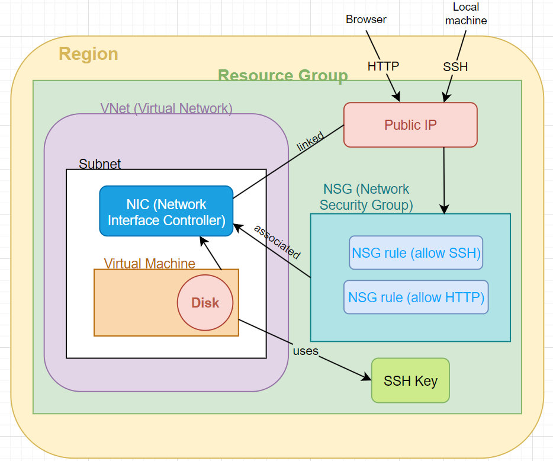

# Azure

### Azure is divided into *Scopes*:

1. Root Management Group
2. Management Groups (6 levels)
3. Subscriptions
4. Resource Groups
5. Resources

 

### Important points:
* Management Groups = a way to manage and access company polices for multiple subscriptions.
* Subscriptions = payment account/methods/scheme.
* All resources need to be inside *a Resource Group*. 
* With these layers (**Scopes**), we apply policies/permissions/compliance. You can set *different policies or permissions for each Scope.* 
* We will add *'owner'* tag (with our Name) to each resource we create.
* *Azure Firewall* - a very expensive service (cheapest version **£250/month**)
* The interface in Azure is called **The Azure Portal** 
* **Active Directory** => Microsoft's proprietary directory service; it essentially controlls users' ecosystem and enables administrators to manage permissions and control access to network resources. 
* **SLA (Service Level Agreement)**: guarantees the more they fall short, the more money you can ask back:

 

### Marketshare:

In the fourth quarter of 2022, the most popular vendor in the cloud infrastructure services market, Amazon Web Services (AWS), controlled 32 percent of the entire market. Microsoft Azure takes second place with 23 percent market share, followed by Google Cloud with 10 percent market share. Together, these three cloud vendors account for 65 percent of total spend in the fourth quarter of 2022.

 

 

### Comparisons to AWS:
* What we call *VPCs* in AWS, in Azure they are called **Virtual Networks** (*V Nets*).
* There are also Resource Groups in AWS, but we didn't need to use them.
* With AWS, Availability Zones in a Region are not limited to 3. In Azure, AZs per region - maximum of 3 (some have 1 or 2). 
* In Azure, zone = data center.

 

Sources:
- [Active Directory](https://www.lepide.com/blog/what-is-active-directory-and-how-does-it-work/)
- [Worldwide Cloud Services Market share](https://www.statista.com/statistics/967365/worldwide-cloud-infrastructure-services-market-share-vendor/)