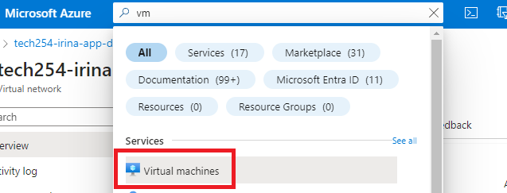
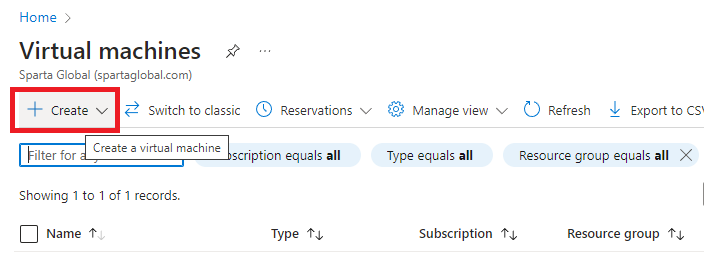
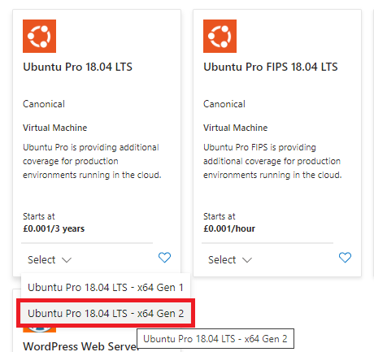
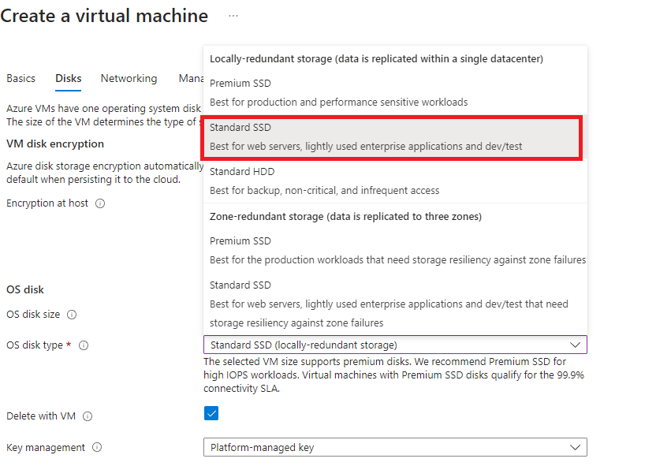
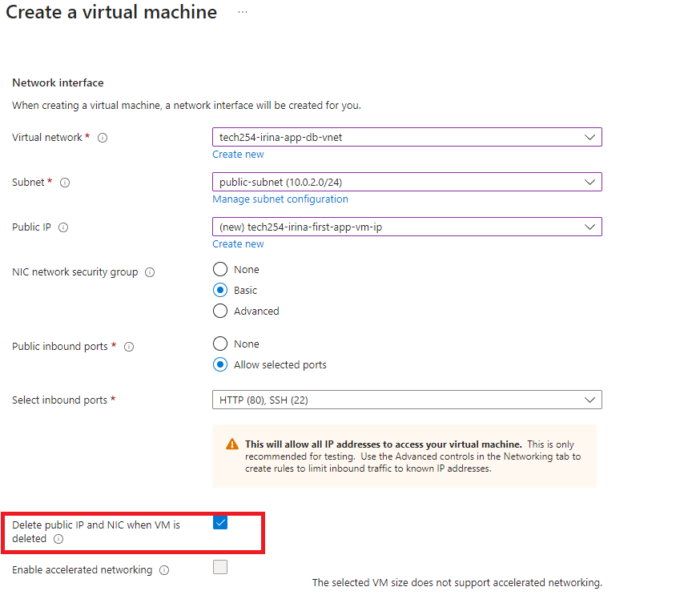

# Azure

### Azure is divided into *Scopes*:
1. Root Management Group
2. Management Groups
3. Subscriptions
4. Resource Groups
5. Resources

<br>

### Comparisons to AWS:
* What we call *VPCs* in AWS, in Azure they are called **Virtual Networks** (*V Nets*).
* There are also Resource Groups in AWS, but we didn't need to use them.
* With AWS, Availability Zones in a Region are not limited to 3. In Azure, AZs per region - maximum of 3 (some have 1 or 2). 
* In Azure, zone = data center.

<br>

### Important points:
```diagram placeholder```


* Management Groups = a way to manage and access company polices for multiple subscriptions.
* Subscriptions = payment account/methods/scheme.
* All resources need to be inside *a Resource Group*. 
* With these layers (**Scopes**), we apply policies/permissions/compliance. You can set *different policies or permissions for each Scope.* 
* We will add *'owner'* tag (with our Name) to each resource we create.
* *Azure Firewall* - a very expensive service (cheapest version **£250/month**)
* The interface in Azure is called **The Azure Portal** 
* **Active Directory** => Microsoft's proprietary directory service; it essentially controlls users' ecosystem and enables administrators to manage permissions and control access to network resources. 
* **SLA (Service Level Agreement)**: guarantees the more they fall short, the more money you can ask back:


<br>

### Steps for creating VNet:

1. First, add your SSH key:


2. Creating your SSH key:


3. We will add *'owner'* tag (with our Name) to each resource we create: 


4. Double check all the fields, then press Create:


5. Next we will create the 'VNet':


6. Click on Create:


7. Enter resource group, VNet name and Region:


8. Add Public Subnet:


9. Add Private Subnet:


10. The CIDR Blocks and Subnets:


11. Add resource tag for your name:


12. Check all information entered, then press Create:


13. It will confirm 'Deployment succeeded':


<br>

### Steps for Spinning Up an Instance with the App running:

1. Go to Virtual Machines:



2. Click Create:



3. Select Azure virtual machine:


4. Search for `ubuntu pro 18.04 lts`:


5. Select Gen2:



6. You will get this error, select 'Standard' for Security Type:


7. In case you have a bug when selecting this, go to Marketplace and search for `ubuntu pro 18.04 lts`:


8. Select VM size:


9. To recap, select Resource group, VM name, region, Availability zone:


10. Size:


11. Change to `admin user` and choose your security key:


12. Choose ports: 


13. Choose Standard SSD:



14. Delete with VM:


15. Add User Data:


```shell

#!/bin/bash

# update & upgrade
sudo apt update -y
sudo apt upgrade -y 

# install nginx
sudo apt install nginx -y

# setup nginx reverse proxy
sudo apt install sed

# $ and / characters must be escaped by putting a backslash before them
sudo sed -i "s/try_files \$uri \$uri\/ =404;/proxy_pass http:\/\/localhost:3000\/;/" /etc/nginx/sites-available/default

# restart nginx 
sudo systemctl restart nginx

# enable nginx
sudo systemctl enable nginx

##

# installing git
sudo apt install git -y

# cloning the app files to the instance
git clone https://github.com/irina-andrei/ci_cd.git

# tell the os what version of nodejs you want
curl -sL https://deb.nodesource.com/setup_12.x | sudo -E bash -

# install nodejs
sudo apt install nodejs -y

# install process manager
sudo npm install pm2 -g

# go to the app folder
cd ci_cd/app

# install your app
npm install

# kill any remaining processes
pm2 kill

# run the app
pm2 start app.js

# restart the app
pm2 restart app.js
```


16. Select VNet, subnet, Public IP and choose delete:



17. Add Name Tag:


18. Check all information is correct, then click Create:


19. Confirmation of deployment complete:


20. Your VM:


21. If you want to remove VM, click Delete:


<br>

Sources:
- [Active Directory](https://www.lepide.com/blog/what-is-active-directory-and-how-does-it-work/)