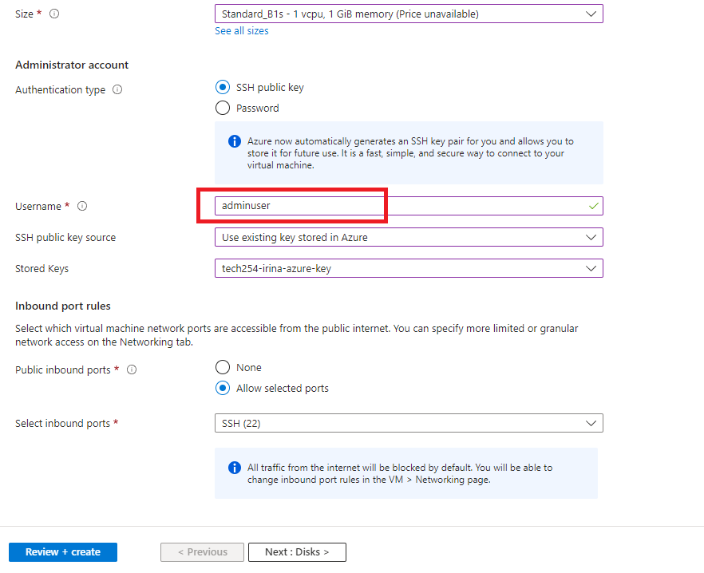

# Getting the App and Database Running (using User Data)


## Database VM

User Data: 

```shell
#!/bin/bash

# update & upgrade
sudo apt update && sudo DEBIAN_FRONTEND=noninteractive apt upgrade -y

# Getting the correct version of MongoDB
wget -qO - https://www.mongodb.org/static/pgp/server-3.2.asc | sudo apt-key add -

echo "deb http://repo.mongodb.org/apt/ubuntu xenial/mongodb-org/3.2 multiverse" | sudo tee /etc/apt/sources.list.d/mongodb-org-3.2.list

sudo apt update

# Installing MongoDB
sudo apt-get install -y mongodb-org=3.2.20 mongodb-org-server=3.2.20 mongodb-org-shell=3.2.20 mongodb-org-mongos=3.2.20 mongodb-org-tools=3.2.20

# Changing the default IP allowed to 0.0.0.0
sudo sed -i 's/bindIp: 127.0.0.1/bindIp: 0.0.0.0/' /etc/mongod.conf

# If running from the terminal, will echo this to console to confirm:
echo "Modified MongoDB configuration to allow all connections."

# Starting MongoDB
sudo systemctl start mongod

# Enabling MongoDB
sudo systemctl enable mongod

# Seeing the current status of MongoDB (if working, will say 'active')
sudo systemctl status mongod
```

<br>

### App VM

1. Go to Virtual Machines:


2. Click Create:


3. Select Azure virtual machine:


4. Search for `ubuntu pro 18.04 lts`:


5. Select Gen2:


6. You will get this error, select 'Standard' for Security Type:


7. In case you have a bug when selecting this, go to Marketplace and search for `ubuntu pro 18.04 lts`:


8. Select VM size:


9. To recap, select Resource group, VM name, region, Availability zone:


10. Size:


11. Change to `admin user` and choose your security key:



12. Choose ports: 


13. Choose Standard SSD:


14. Delete with VM:


15. Add User Data:


```shell
#!/bin/bash

# update & upgrade
sudo apt update && sudo DEBIAN_FRONTEND=noninteractive apt upgrade -y

# install nginx
sudo apt install nginx -y

##

# setup nginx reverse proxy
sudo apt install sed

# $ and / characters must be escaped by putting a backslash before them
sudo sed -i "s/try_files \$uri \$uri\/ =404;/proxy_pass http:\/\/localhost:3000\/;/" /etc/nginx/sites-available/default

##

# restart nginx 
sudo systemctl restart nginx

# enable nginx
sudo systemctl enable nginx


##

# installing git
sudo apt install git -y

# cloning the app files to the instance
git clone https://github.com/irina-andrei/ci_cd.git

# tell the os what version of nodejs you want
curl -sL https://deb.nodesource.com/setup_12.x | sudo -E bash -

# install nodejs
sudo apt install nodejs -y

# install process manager
sudo npm install pm2 -g

# go to the app folder
cd ci_cd/app

# Exporting DB_HOST
export DB_HOST=mongodb://==PUBLIC_DB_VM_IP_ADDRESS==:27017/posts

# restart nginx
sudo systemctl restart nginx

# install your app
npm install

# kill any remaining processes
pm2 kill

# seed db
node seeds/seed.js

# run the app
pm2 start app.js

# restart the app
pm2 restart app.js
```

16. Select VNet, subnet, Public IP and choose delete:


17. Add Name Tag:


18. Check all information is correct, then click Create:


19. Confirmation of deployment complete:


20. Your VM:


21. If you want to remove VM, click Delete:


<br>