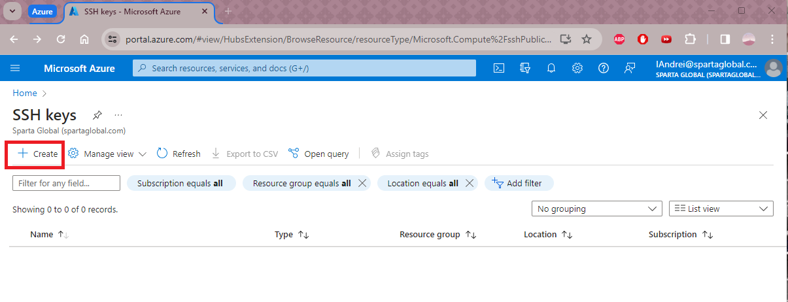
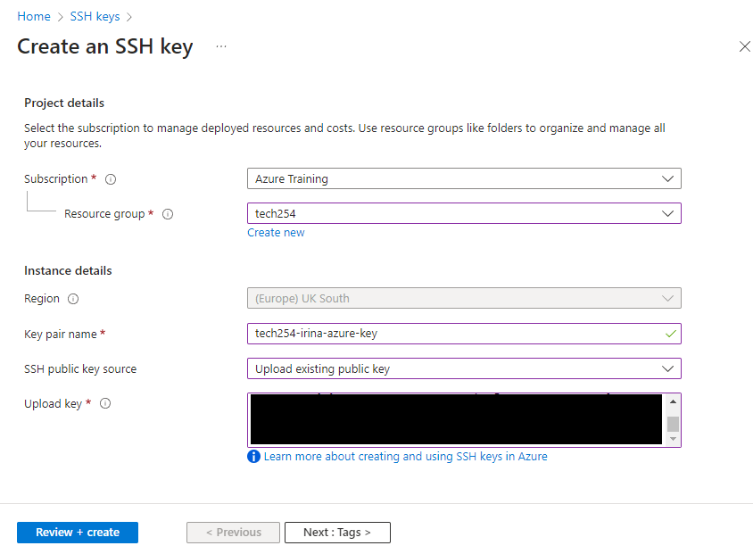
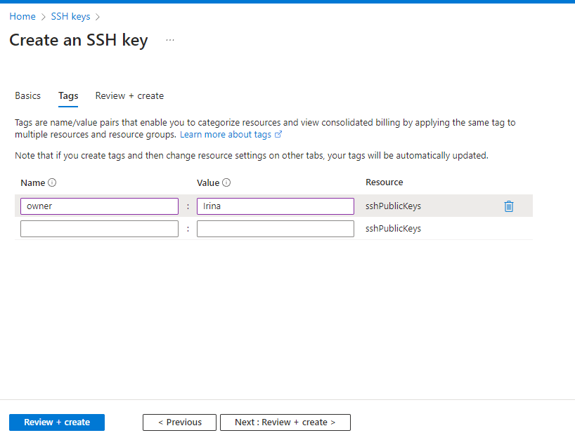
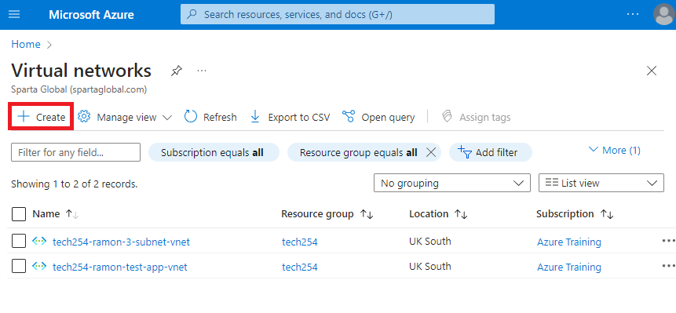
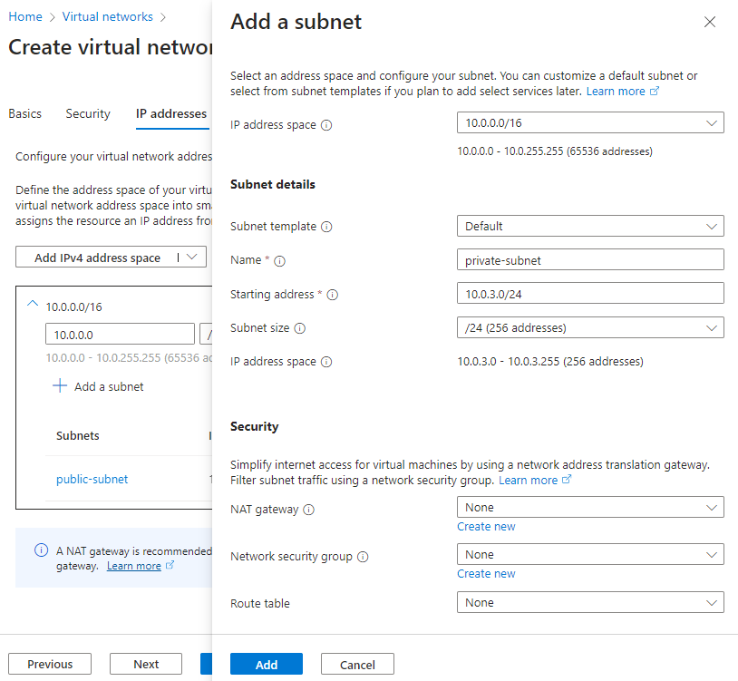
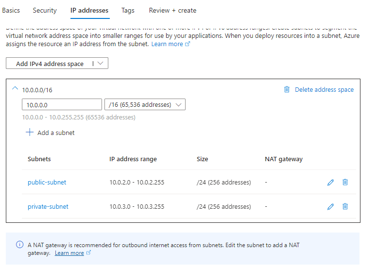
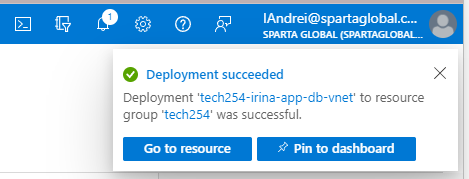

# Steps for creating VNet (Virtual Network):

1. First, add your SSH key:

2. Creating your SSH key:

3. We will add *'owner'* tag (with our Name) to each resource we create: 

4. Double check all the fields, then press Create:

5. Next we will create the 'VNet':

6. Click on Create:

7. Enter resource group, VNet name and Region:

8. Add Public Subnet:

9. Add Private Subnet:

10. The CIDR Blocks and Subnets:

11. Add resource tag for your name:

12. Check all information entered, then press Create:

13. It will confirm 'Deployment succeeded':

